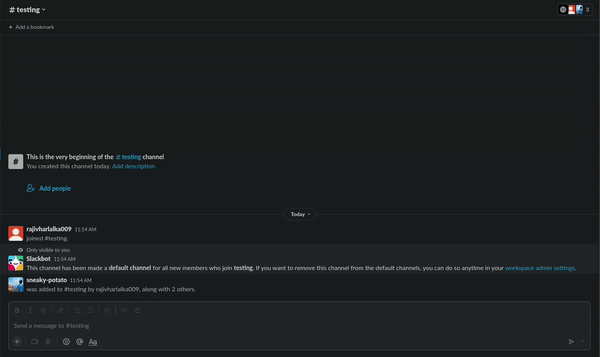

<div style="display:">


</div>

<br><br><br>

## Intro
Ever felt short of file storage while using slack? I (we at [KOSS](https://kossiitkgp.org)) did. So [Dibya Das](https://github.com/dibyadas) made [Imagery](https://github.com/dibyadas/imagery). 

So after tinkering around with Golang, wanted to learn by doing and Imagery had some issues due to some api changes on slack. So what could be better than re-writing the entire thing on go :rocket:.

Go-space is a slack-bot which helps to free slack storage by uploading the image to imgur and replacing the image with the link. Just need to add him to the channel and you are good to go.
- Currently supports only images
- both private and public channels can be used on.
- react the bots message with `:cross:` to delete the message.

### Demo



## Installation

### Using Docker
To create a docker file and push to dockerhub
```bash
git clone https://github.com/rajivharlalka/go-space.git
cd go-space
docker build -t <dockerhub-username>/go-space:v1 .
docker push <dockerhub-username>/go-space:v1
```

### Run docker file
#### Environment Requirements
```
SLACKBOT_ACCESS_TOKEN=<BOT TOKEN>
SLACKUSER_ACCESS_TOKEN=<USER TOKEN>
IMGUR_CLIENT_ID=<KEY>
```
It runs on port 3000 inside docker, so that port has been exported.
```
docker run -dp 3000:3000 -e IMGUR_CLIENT_ID=<IMGUR_CLIENT_ID> -e SLACKBOT_AUTH_TOKEN=<SLACKBOT_AUTH_TOKEN> -e SLACKUSER_AUTH_TOKEN=<SLAKCUSER_AUTH_TOKEN> <DOCKERHUB-USERNAME>/imagery:v1
```

Now, configure the app on [slack dev](https://api.slack.com/) for permissions and webhooks.

- Add `<base-url>/app` to event subscriptions, and add `file_shared` and `reaction_added` to Subscribe bot Events.
- Add `channels:history` ,`chat:write`,`files:read`,`files:write`,`groups:history`,`incoming-webhook` and `reactions:read` to Bot Token scope.
- Add `channels:history`,`files:read`,`files:write`,`chat:write` and `groups:history` to user token scopes.
- Add `<base-url>/activity-route` to interactivity to subscribe for button presses.

## Usage

### API Endpoints

`/app` - the base route for event subscription endpoint.<br>
`/activity-route` - route for handling user activity through buttons.

## Contributing
Pull requests are welcome. For major changes, please open an issue first to discuss what you would like to change.

Thanks to [Chirag Ghosh](https://github.com/chirag-ghosh) for helping me out in completing this :smile:

## License
[MIT](https://choosealicense.com/licenses/mit/)
